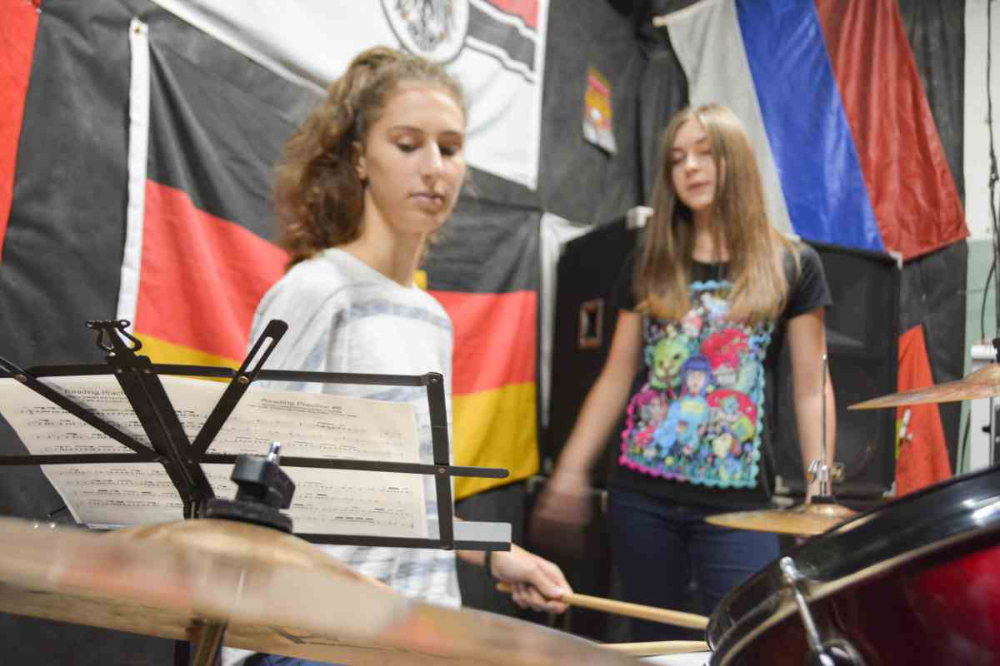
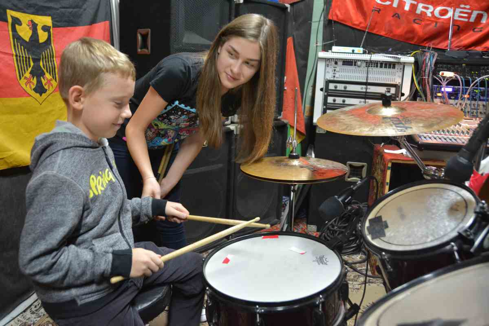

_Wonder Records_ представляет Школу барабанщиков **"Novodrum"**!
Вас будет курировать дипломированный барабанщик _Светлана Вязнина_.

---

1. Одно занятие длится один час, но мы рекомендуем заниматься не менее двух часов.
2. Занятия проходят у нас на студии.
3. Стоимость одного занятия равна 400 рублей.
4. Занятия проводятся для разных возрастов: от школьного до пенсионного.

Записывайся по телефону: [+7 938 405-78-73](tel://879384057873)
или на странице [контактов](/contacts.html)

С барабанщиками в Новороссийске тухло, так что вы – последняя надежда. Так докажите же, что именно таких музыкантов заслуживает этот город!
Посмотрите на мальчика на фото. Ему всего 8, но он уже космически крут.
У вас тоже есть возможность прокачаться!

### Миф 1. На барабанах очень сложно научиться играть
Глупости! На барабанах сложно играть только тем, кто их боится. К счастью, Светлана может помочь вам справиться со страхом и сделать первые шаги к мировому турне.
### Миф 2. Выглядит клево, но я не знаю, с какой стороны вообще к барабанам подойти, их там куча, да еще и эти тарелки…  
Поверьте, здесь нет ничего сложного. Все, что нужно для решения этой проблемы – не путать левую руку с правой. Порой это нелегко, согласны, но, как правило, со второго раза справляются все. Просто приходите на урок, и Светлана покажет вам азы.
### Миф 3. Я хочу играть, но злобные соседи засунут мне палки туда, где не светит солнце. Что делать?
Одеваться и идти к нам. Вот уже можно выходить. У нас можно от души выстучаться. И еще у нас вам подскажут пару лайфхаков, как можно избежать гражданской войны с соседями. Так что ждем.
### Миф 4. Зачем мне учиться, я и так круче всех.
Никто не спорит. Вот правда. Но и учиться никогда не поздно. Особенно, у людей, которые в этом деле понимают, имеют опыт и соответствующие дипломы.  
### Миф 5. Это дорого.
А вот и нет. Не нужно покупать самую лучшую барабанную установку в первый же день. И палочки тоже самые дорогие не надо.
**ЭТО ВАМ НЕ ПОМОЖЕТ ЗВУЧАТЬ ЛУЧШЕ.**
Это суровая правда. Так что поначалу ваши затраты будут минимальны. Час работы с инструктором стоит не дороже похода в МакДак и уж куда дешевле арканы на Зевса. Вот только можно есть картоху фри и грустно думать, что денег нет, а можно сделать первый шажочек к своей мечте.
### Миф 6. Да ну че я буду барабанщиком, их все равно на сцене не видно, а я хочу звездеть.
Барабанщик – это сердце группы. Если оно не стучит, то и группа функционировать не может. Вот и все. Вокалисты, гитаристы – их навалом. Плюнь в рандомного чувака на улице – и он пропишет тебе ответку мозолистой рукой басиста. А вот хороший барабанщик на вес золота. Рецепт счастья таков – надо просто стать хорошим барабанщиком, или хотя бы приличным, и вам на улице уже не будут давать проходу. Особенно, если взять во внимание ситуацию с барабанщиками в Новороссийске.
### Миф 7. Без таланта барабанщиком не стать.
Тоже неверно. Вот если рук нет – то это да, это проблема. Талант – это вообще очень редкий мифический зверь, его мало кто видел. Есть люди, которые «чувствуют ритм» и все такое. Но это не умение с рождения говорить на змеином языке, этому можно научиться. Решают практика и скилл, а не какой-то там талант.
### Миф 8. Это ж столько времени надо потратить, чтобы научиться играть на барабанах….
Да, дофига. Иначе никак. А что вы хотели? И опять-таки, можно набивать часы в Доте2, а можно набивать руку и отрабатывать ритмы. Это уж кому как.

---

Записывайся по телефону: [+7 938 405-78-73](tel://879384057873)
или на странице [контактов](/contacts.html)
